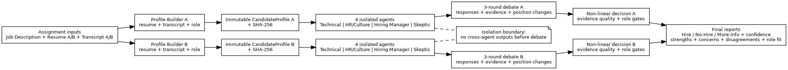

# Multi-Agent AI Interview Panel Simulator

Evidence-grounded candidate evaluation engine built to the supplied instructor problem statement.

The system processes **both Candidate A and Candidate B** from a shared job description and runs:

1. Candidate Profile Builder
2. Four isolated personas: Technical, HR/Culture, Hiring Manager, Skeptic
3. A real three-round structured debate
4. A non-linear final decision engine
5. A traceable final report for each candidate

The implementation accepts **PDF, TXT, or Markdown input documents**. The included sample uses PDFs to mirror the assignment's supplied-material format.

## Why this matches the assignment

The instructor requires the shared profile, four independent LLM calls, evidence-backed findings, an actual debate, a non-averaged final decision, a final report, and processing of both candidates. This repository implements each of those requirements directly.

### Isolation contract

During the independent stage, each persona receives exactly one immutable `CandidateProfile` plus its own persona system prompt. No persona receives another persona's output, scores, or conclusions. Independent outputs are locked before the debate payload is constructed.

### Evidence contract

Every finding contains one or more `EvidenceRef` objects with a source, section, fact ID, and verbatim quote. The LLM-backed extractor validates that returned quotes literally occur in the supplied resume/interview source.

### Immutability contract

`CandidateProfile` and all nested profile facts use frozen models and immutable tuple fields. Persisted profiles are accompanied by a SHA-256 sidecar. The orchestrator verifies the digest before and after every independent evaluation.

### Debate contract

The debate runs three rounds. Each turn has an explicit response target, cites findings/evidence, records its position before and after, and supplies a reason whenever the position changes. The orchestrator rejects a run that lacks an inter-agent response or an opinion change.

### Decision contract

The final decision does not average agent scores. It applies evidence-quality weighting, source directness, role fit, critical-severity gates, contradiction/debate gates, and acceptance/rejection thresholds. `MORE_INFO` is a first-class outcome when the evidence does not justify a confident hire/no-hire.

## Project structure

```text
candidate_eval_system/
├── candidate_eval/
│   ├── agents.py
│   ├── batch.py
│   ├── cli.py
│   ├── debate.py
│   ├── decision.py
│   ├── ingestion.py
│   ├── llm.py
│   ├── mock_data.py
│   ├── models.py
│   ├── orchestrator.py
│   ├── profile_builder.py
│   ├── prompts.py
│   └── report.py
├── config/default.yaml
├── sample/
│   ├── job_description.pdf
│   ├── candidate_A/{resume.pdf,transcript.pdf}
│   ├── candidate_B/{resume.pdf,transcript.pdf}
│   └── expected_output/      # generated demo reports and bundles
├── tests/test_core.py
├── architecture_diagram.png
├── main.py
├── pyproject.toml
├── requirements.txt
├── requirements-openai.txt
├── Dockerfile
├── .env.example
├── .gitignore
├── LICENSE
├── SECURITY.md
└── CONTRIBUTING.md
```

## Setup

Python 3.11+ is required.

```bash
python -m venv .venv
# Windows
.venv\\Scripts\\activate
# Linux/macOS
source .venv/bin/activate

pip install -r requirements.txt
```

## Run the complete assignment flow offline

The default mock provider is deterministic and does not require an API key.

```bash
python main.py --input-dir sample --output-dir output
```

or:

```bash
python -m candidate_eval --input-dir sample --output-dir output
```

This processes **both candidates** and creates:

```text
output/
├── batch_manifest.json
├── Alex_Menon/
│   ├── profile-*.json
│   ├── profile-*.json.sha256
│   ├── evaluation_bundle.json
│   └── report.md
└── Priya_Shah/
    ├── profile-*.json
    ├── profile-*.json.sha256
    ├── evaluation_bundle.json
    └── report.md
```

The exact candidate directory names depend on the extracted names.

## Use the instructor's actual files

Place the supplied files in either of these supported layouts.

### Preferred layout

```text
my_inputs/
├── job_description.pdf
├── candidate_A/
│   ├── resume.pdf
│   └── transcript.pdf
└── candidate_B/
    ├── resume.pdf
    └── transcript.pdf
```

### Direct assignment naming layout

```text
my_inputs/
├── 02_Job_Description.pdf
├── 03_Resume_A.pdf
├── 04_Resume_B.pdf
├── 05_Transcript_A.pdf
└── 06_Transcript_B.pdf
```

Then run:

```bash
python main.py --input-dir my_inputs --provider mock --output-dir output
```

For a live LLM backend, install the optional dependency and configure an API key:

```bash
pip install -r requirements-openai.txt
copy .env.example .env     # Windows
# or: cp .env.example .env
```

Set `OPENAI_API_KEY` and `OPENAI_MODEL`, then:

```bash
python main.py --input-dir my_inputs --provider openai --output-dir output
```

## Tests

```bash
pytest -q
```

The test suite verifies PDF ingestion, both-candidate discovery, deep profile immutability, profile hashing, evidence grounding, three-round debate behavior, recorded opinion changes, and full batch execution.

## Sample execution

`sample/expected_output/` contains the deterministic example generated from the included sample PDFs. This is demonstration data, not the instructor's hidden ground truth.

## Architecture



## Configuration

`config/default.yaml` controls the provider, model name, critical severity threshold, and persona influence factors. The influence factors are **not** score-averaging weights; they scale evidence-backed support inside the non-linear decision gates. The verified default OpenAI model name in this package is `gpt-5.6`; it can be overridden through `OPENAI_MODEL`.

## Security and privacy

Do not commit `.env`, API keys, real candidate data, or private interview transcripts. The `.gitignore` excludes secrets, local environments, caches, and generated output. See `SECURITY.md` for repository handling guidance.

## Known scope

The instructor describes voice debate as a bonus. The core required evaluation pipeline is complete without requiring voice services. The repository does not pretend to provide a voice implementation that is not necessary for the required 100-point rubric.

## License

MIT. See `LICENSE`.

## Submission notes

`SUBMISSION_CHECKLIST.md` is the repository-level compliance map for the supplied assignment. `requirements-lock.txt` records the dependency versions used for the verified environment; `requirements.txt` remains the flexible installation specification.
